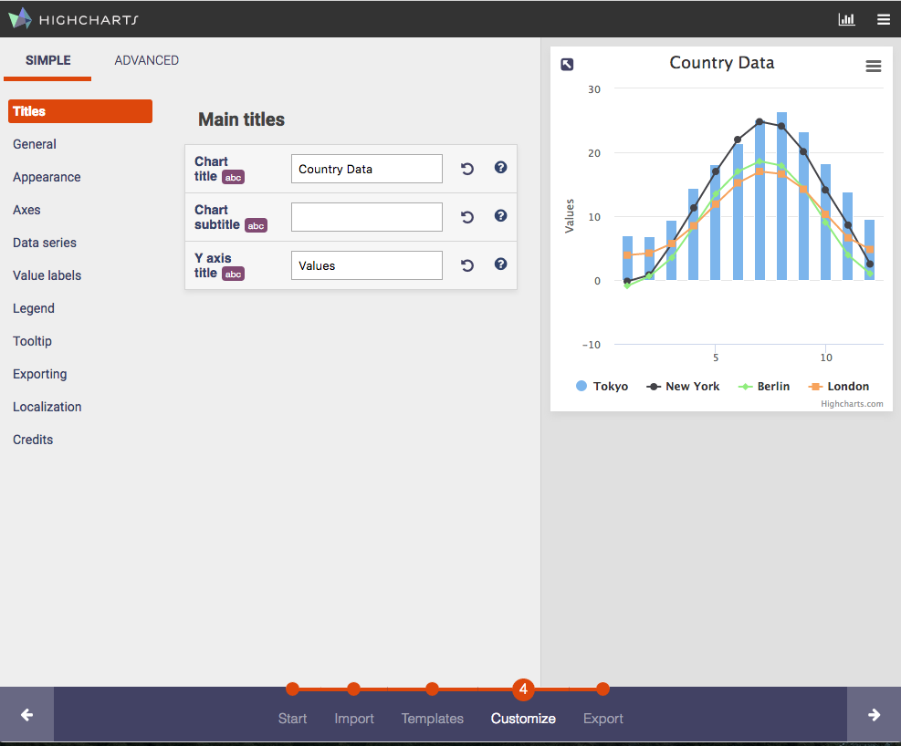

Highcharts Editor
===

*Stand-alone and embeddable chart editor for Highcharts*

## Introduction

`highcharts-editor` is a lightweight chart editor for highcharts that can be embedded into existing frameworks and libraries, or used stand-alone.
It requires no back-end service to operate.

## Features
	
  * No dependencies except from Highcharts
  * Lightweight: weighs in at less than 100kb
  * 100% client-side
  * Outputs both HTML and JSON
  * Optional wizard-style interface
  * Highly configurable

## Installing and Building

**Pre-built**

You can find pre-built stable releases [here](https://github.com/highcharts/highcharts-editor/releases).

**Package Managers**

The editor is pushed to NPM and Bower under `highcharts-editor`.

**Cloning and building the repository**

	git clone https://github.com/highcharts/highcharts-editor
	cd highcharts-editor
	npm install
	gulp

This will put a built version in the `dist` folder.

## Embedding Hello World

	<!DOCTYPE html>
	<html>
		<head>

		</head>
		<body>
			

		</body>
		
	</html>

## Integrations

### TinyMCE

If you're using TinyMCE, and would like to be able to insert Highchart charts from it, simply include `dist/highcharts-editor.tinymce.min.js` in your page. Remember to bake first! 

**Do not include `highcharts-editor.min.js` when including the tinymce plugin! The editor is baked into the same script for your convinience!**

After the script is included, create your editor with the highcharts plugin enabled:
    
    tinymce.init({
        selector: "textarea",
        plugins: [
            "highcharts highchartssvg noneditable"
        ]
    });

Notice that there are two plugins - highcarts and highchartssvg. The former will embed an interactive chart, whereas the later will embed a static SVG chart.

If you use the interactive version, please keep in mind that the plugin will alter the editor's `allowed_fields` to allow the script tag in order to display the graph. 
The static version may therefore be more suitable to applications where the editor is available to un-vetted users to avoid security concerns. 

Both plug-ins add entries into the `Insert` menu in TinyMCE. Note that the interactive version will insert an SVG chart which will be overridden when viewing the page you're editing. This is to provide a fallback in cases where JavaScript isn't available (e.g. NoScript etc.).

You should also use the `noneditable` plug-in to avoid accidentally deleting parts of the chart, and to make it easy to delete charts when required.

### Wordpress

Once `gulp` has been ran, a wordpress plugin will appear at `dist/highcharts-editor.wordpress.zip`. This can be uploaded straight to your installation.

Alternatively you can find a pre-built version [here](#).

### Electron

To build a native version, run `gulp electron`. This will create executables for windows and osx in the `dist/eleectron/` folder.

## API Quick Reference

**Full documentation can be found [here](#).**

### highed.Editor

The `highed.Editor` object is the full chart editor, containing by default a wizard-style interface for chart creation.

**Constructor**

`highed.Editor(parent, properties)` creates a new chart editor instance, and attaches it to the supplied parent node. The `parent` argument can either be a string containing the ID of a DOM node, or a DOM node instance.

Properties is an object as such:
		
	{
        //The initial chart options
        defaultChartOptions: <object>,
        //Events to listen for - same as calling Editor.on(...)
        on: {
            'EventName': <function>
        },
        //Plugins to use
        plugins: {
            <name of plugin>: <object with plugin options>
        },
        //If true, an SVG chart will be inserted when exporting to provide
        //a fallback when js is not enabled/available.
        includeSVGInHTMLEmbedding: bool,
        //Features to use
        features: 'import export templates customize'
	}

**Interface**

  * `Editor.on(<event>, <callback>)`: Listen for an event emitted by the editor. See list of events below.
  * `Editor.resize()`: Force a resize of the editor widget.
  * `Editor.getEmbeddableHTML()`: Get a string containing HTML to replicate the current chart.
  * `Editor.getEmbeddableJSON()`: Get a json string containing the current charts properties that can be used to initialize a duplicate chart.

**Editor Events**

  * `Resized`: Emitted when the editor is resized
  * `ChartChange`: Emitted when the chart being edited changes. Passed argument is the current chart settings. 

## Customizing the exposed settings

Sometimes, only a sub-set of editable settings is required. 

To that end, the `update.meta` tool in the `tools/` folder can be used to create a custom build of the editor which only includes the desired settings.

**Usage**
        
        node tools/update.meta.js --exposed <JSON file with an array of options to include>

After running the tool, run `gulp` in the project root to bake your custom build.
Take a look at [dictionaries/exposed.settings.json](dictionaries/exposed.settings.json) to see how to format the input JSON file. 

## Enabling the Advanced Property Editor

The advanced editor allows for editing every property in the Highcharts API. When enabled, it appears in a separate tab --- ADVANCED --- in the customize wizard step.

By default, only the simple property editor is included in baked sources. This is because the required meta data to enable the advanced editor is large enough to be inconvenient in most cases (adds around 400kb to the minified sources).

To enable the advanced editor:
    
    node tools/updatebake.advanced.js

This will create the required meta in the source tree. Run `gulp` afterwards to bake sources with the advanced editor enabled.

## Plugins

The editor supports data handling plugins. Plugins are registered using the `highed.plugins.install` function. They must also be activated, either by calling `highed.plugins.use(<plugin name>, <plugin options>)`, or by supplying the name of the plugin in the editor constructor (see editor section above).

See [plugins/jquery-simple-rest.js](plugins/jquery-simple-rest.js) for an example on how to write plugins.

## License

[MIT](LICENSE).